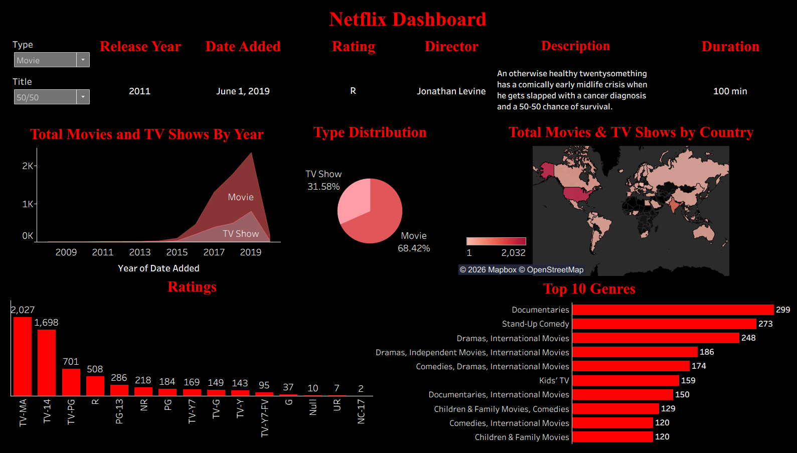

# 🎬 Netflix Content Analysis Dashboard (Tableau)

## 📌 Project Overview
This project presents a Tableau dashboard analyzing Netflix content to uncover trends related to genres, countries, ratings, and release years.

The dashboard was created as a hands-on analytics exercise to practice data visualization and exploratory data analysis using Tableau.

---

## 📊 Key Insights & Analysis
- Distribution of movies and TV shows by genre
- Content availability across different countries
- Rating categories and their frequency
- Trends in content releases over time

---

## 🛠 Tools & Technologies
- Tableau
- Data Visualization
- Exploratory Data Analysis (EDA)

---

## 📁 Data Source
Public Netflix dataset (for educational purposes)

---

## 📷 Dashboard Overview

### 

